# P&S Modern SSDs

# Basics of NAND Flash-Based SSDs

Dr. Mohammad Sadrosadati

Prof. Onur Mutlu

ETH Zürich

Fall 2022

12 October 2022

 SSD Organization & Request Handling   
NAND Flash Organization

 A modern SSD is a complicated system that consists of multiple cores, HW controllers, DRAM, and NAND flash memory packages

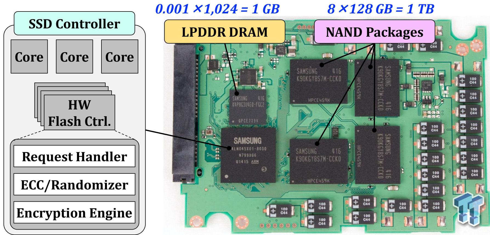

text_image

SSD Controller
Core Core Core
HW
Flash Ctrl.
Request Handler
ECC/Randomizer
Encryption Engine
0.001 × 1,024 = 1 GB
8 × 128 GB = 1 TB
LPDDR DRAM
NAND Packages

Samsung PM853T 960GB Enterprise SSD (from https://www.tweaktown.com/reviews/6695/samsung-pm853t-960gb-enterprise-ssd-review/index.html)

# Another Overview

# Host Interface Layer (HIL)

# Flash Translation Layer (FTL)

Data Cache Management

Address Translation

GC/WL/Refresh/…

# Flash Controller

ECC

Randomizer

CTR

CTR

NAND

Flash

Package

NAND

Flash

Package

NAND

Flash

Package

# DRAM

Host Request Queue

Write Buffer

Logical-to-Physical Mappings

Metadata (e.g., P/E Cycles)

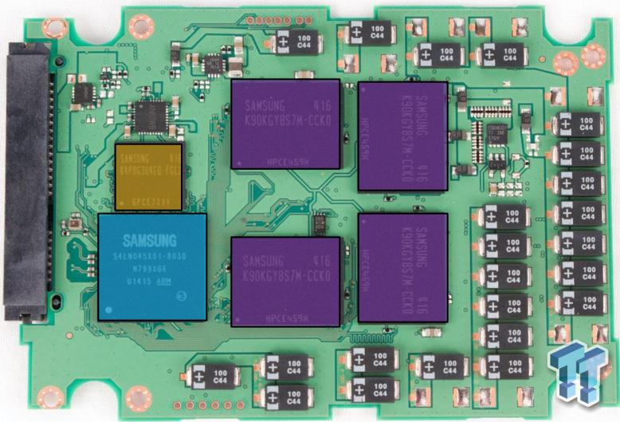

text_image

SAMSUNG 416
K90KGY8S7M-CKD0
HPCE459H
SAMSUNG 416
K90KGY8S7M-CKD0
HPCE459H
SAMSUNG 416
K90KGY8S7M-CKD0
HPCE459H
SAMSUNG 416
K90KGY8S7M-CKD0
HPCE459H
100
C44
100
C44
100
C44
100
C44
100
C44
100
C44
100
C44
100
C44
100
C44
100
C44
100
C44
100
C44
100
C44
102
C44
100
C44
100
C44
100
C44
100
C44
100
C44
100
C44
100
C44
100
C44
100
C44
100
C44
100
C44
100
C43

# Host Interface Layer (HIL)

Flash Translation Layer (FTL)

Data Cache Management

Address Translation

GC/WL/Refresh/…

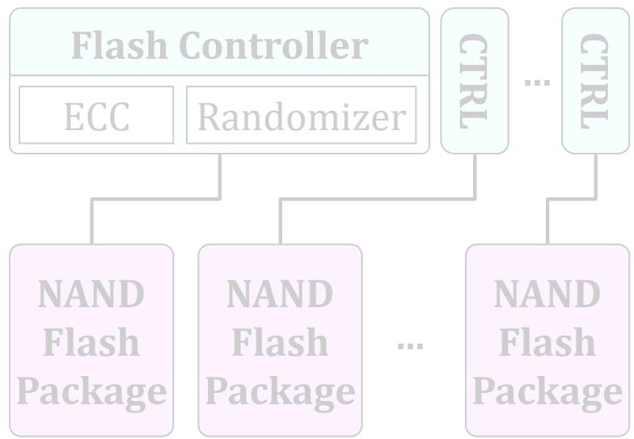

flowchart

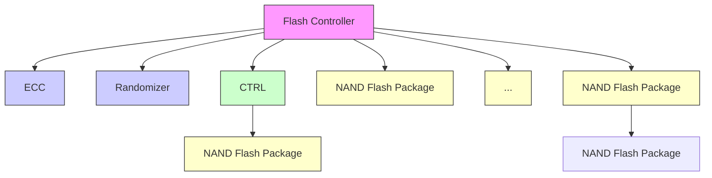
```mermaid
graph TD
    A["Flash Controller"] --> B["ECC"]
    A --> C["Randomizer"]
    A --> D["CTRL"]
    D --> E["NAND Flash Package"]
    A --> F["NAND Flash Package"]
    A --> G["..."]
    A --> H["NAND Flash Package"]
    H --> I["NAND Flash Package"]
    style A fill:#f9f,stroke:#333
    style B fill:#ccf,stroke:#333
    style C fill:#ccf,stroke:#333
    style D fill:#cfc,stroke:#333
    style E fill:#ffc,stroke:#333
    style F fill:#ffc,stroke:#333
    style G fill:#ffc,stroke:#333
    style H fill:#ffc,stroke:#333
```

# DRAM

Host Request Queue

Write Buffer

Logical-to-Physical Mappings

Metadata (e.g., P/E Cycles)

 Communication with the host operating system (receives & returns requests)

Via a certain interface (SATA or NVMe)

A host I/O request includes

Request direction (read or write)

 Offset (start sector address)

 Size (number of sectors)

Typically aligned by 4 KiB

# Request Handling: Write

Host Interface Layer (HIL)

# Flash Translation Layer (FTL)

Data Cache Management

Address Translation

GC/WL/Refresh/…

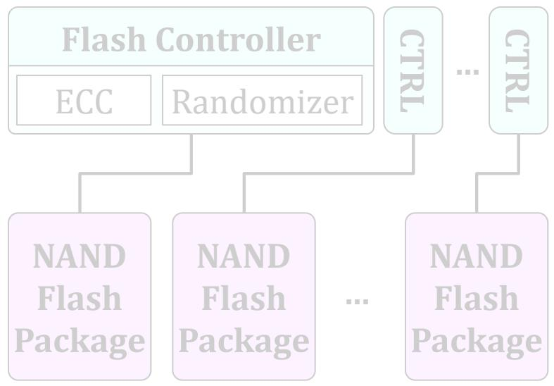

flowchart

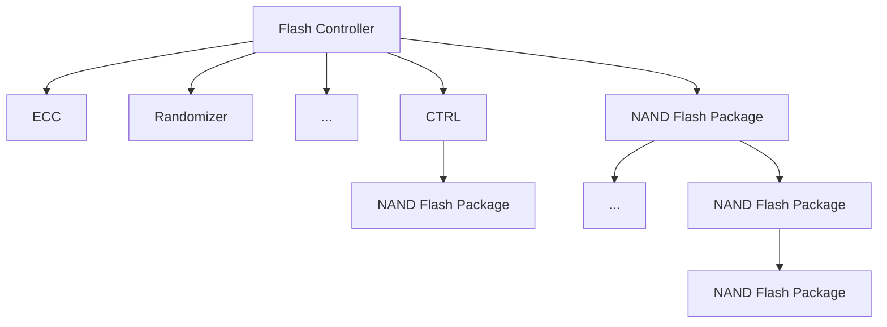
```mermaid
graph TD
    A["Flash Controller"] --> B["ECC"]
    A --> C["Randomizer"]
    A --> D["..."]
    A --> E["CTRL"]
    E --> F["NAND Flash Package"]
    A --> G["NAND Flash Package"]
    G --> H["..."]
    G --> I["NAND Flash Package"]
    I --> J["NAND Flash Package"]
```

# DRAM

Host Request Queue

Write Buffer

Logical-to-Physical Mappings

Metadata (e.g., P/E Cycles)

 Buffering data to write (read from NAND flash memory)

Essential to reducing write latency   
Enables flexible I/O scheduling   
Helpful for improving lifetime (not so likely)

Limited size (e.g., tens of MBs)

 Needs to ensure data integrity even under sudden power-off   
Most DRAM capacity is used for L2P mappings

# Request Handling: Write

Host Interface Layer (HIL)

# Flash Translation Layer (FTL)

Data Cache Management

Address Translation

GC/WL/Refresh/…

flowchart

```mermaid
graph TD
    A["Flash Controller"] --> B["ECC"]
    A --> C["Randomizer"]
    A --> D["..."]
    A --> E["CTRL"]
    E --> F["NAND Flash Package"]
    A --> G["NAND Flash Package"]
    G --> H["..."]
    G --> I["NAND Flash Package"]
    I --> J["NAND Flash Package"]
```

# DRAM

Host Request Queue

Write Buffer

Logical-to-Physical Mappings

Metadata (e.g., P/E Cycles)

Core functionality for out-of-place writes

 To hide the erase-before-write property

 Needs to maintain L2P mappings

Logical Page Address (LPA)   
 Physical Page Address (PPA)

 Mapping granularity: 4 KiB

 4 Bytes for 4 KiB  0.1% of SSD capacity

Host Interface Layer (HIL)

# Flash Translation Layer (FTL)

Data Cache Management

Address Translation

GC/WL/Refresh/…

flowchart

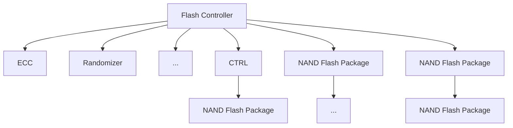
```mermaid
graph TD
    A["Flash Controller"] --> B["ECC"]
    A --> C["Randomizer"]
    A --> D["..."]
    A --> E["CTRL"]
    E --> F["NAND Flash Package"]
    A --> G["NAND Flash Package"]
    G --> H["..."]
    A --> I["NAND Flash Package"]
    I --> J["NAND Flash Package"]
```

# DRAM

Host Request Queue

Write Buffer

Logical-to-Physical Mappings

Metadata (e.g., P/E Cycles)

Garbage collection (GC)

 Reclaims free pages   
Selects a victim block  copies all valid pages  erase the victim block

Wear-leveling (WL)

 Evenly distributes P/E cycles across NAND flash blocks   
Hot/cold swapping

Data refresh

 Refresh pages with long retention ages

# Request Handling: Write

Host Interface Layer (HIL)

Flash Translation Layer (FTL)

Data Cache Management

Address Translation

GC/WL/Refresh/…

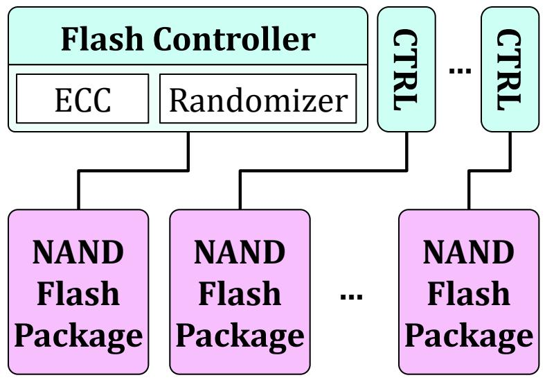

flowchart

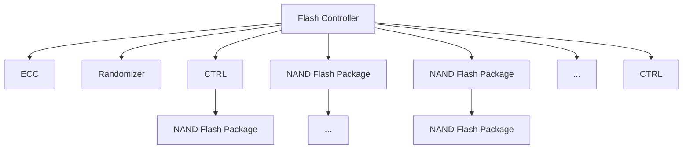
```mermaid
graph TD
    A["Flash Controller"] --> B["ECC"]
    A --> C["Randomizer"]
    A --> D["CTRL"]
    D --> E["NAND Flash Package"]
    A --> F["NAND Flash Package"]
    F --> G["..."]
    A --> H["NAND Flash Package"]
    H --> I["NAND Flash Package"]
    A --> J["..."]
    A --> K["CTRL"]
```

# DRAM

Host Request Queue

Write Buffer

Logical-to-Physical Mappings

Metadata (e.g., P/E Cycles)

# Randomizer

Scrambling data to write   
To avoid worst-case data patterns that can lead to significant errors

# Error-correcting codes (ECC)

Can detect/correct errors: e.g., 72 bits/1 KiB error-correction capability   
Stores additional parity information together with raw data

# Issues NAND flash commands

# Request Handling: Read

Host Interface Layer (HIL)

# Flash Translation Layer (FTL)

Data Cache Management

Address Translation

GC/WL/Refresh/…

flowchart

```mermaid
graph TD
    A["Flash Controller"] --> B["ECC"]
    A --> C["Randomizer"]
    A --> D["..."]
    A --> E["CTRL"]
    E --> F["NAND Flash Package"]
    A --> G["NAND Flash Package"]
    G --> H["..."]
    G --> I["NAND Flash Package"]
    I --> J["NAND Flash Package"]
```

# DRAM

Host Request Queue

Write Buffer

Logical-to-Physical Mappings

Metadata (e.g., P/E Cycles)

 First checks if the request data exists in the write buffer

 If so, returns the corresponding request immediately with the data

 A host read request can be involved with several pages

Such a request can be returned only after all the requested data is ready

# Request Handling: Read

Host Interface Layer (HIL)

# Flash Translation Layer (FTL)

Data Cache Management

Address Translation

GC/WL/Refresh/…

flowchart

```mermaid
graph TD
    A["Flash Controller"] --> B["ECC"]
    A --> C["Randomizer"]
    A --> D["..."]
    A --> E["CTRL"]
    E --> F["NAND Flash Package"]
    A --> G["NAND Flash Package"]
    G --> H["..."]
    G --> I["NAND Flash Package"]
    I --> J["NAND Flash Package"]
```

# DRAM

Host Request Queue

Write Buffer

Logical-to-Physical Mappings

Metadata (e.g., P/E Cycles)

 Finds the PPA where the request data is stored from the L2P mapping table

# Request Handling: Read

Host Interface Layer (HIL)

Flash Translation Layer (FTL)

Data Cache Management

Address Translation

GC/WL/Refresh/…

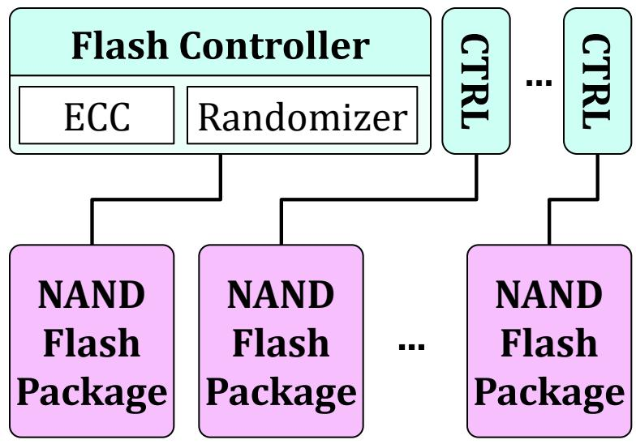

flowchart

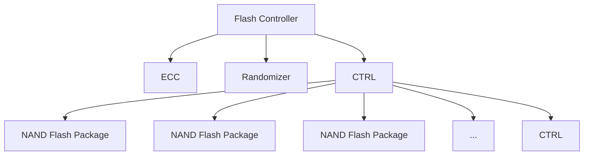
```mermaid
graph TD
    A["Flash Controller"] --> B["ECC"]
    A --> C["Randomizer"]
    A --> D["CTRL"]
    D --> E["NAND Flash Package"]
    D --> F["NAND Flash Package"]
    D --> G["NAND Flash Package"]
    D --> H["..."]
    D --> I["CTRL"]
```

# DRAM

Host Request Queue

Write Buffer

Logical-to-Physical Mappings

Metadata (e.g., P/E Cycles)

 First reads the raw data from the flash chip   
 Performs ECC decoding   
 Derandomizes the raw data   
 ECC decoding can fail

Retries reading of the page w/ adjusted $V _ { \tt R E F }$

 SSD Organization & Request Handling   
NAND Flash Organization

Basically, it is a transistor

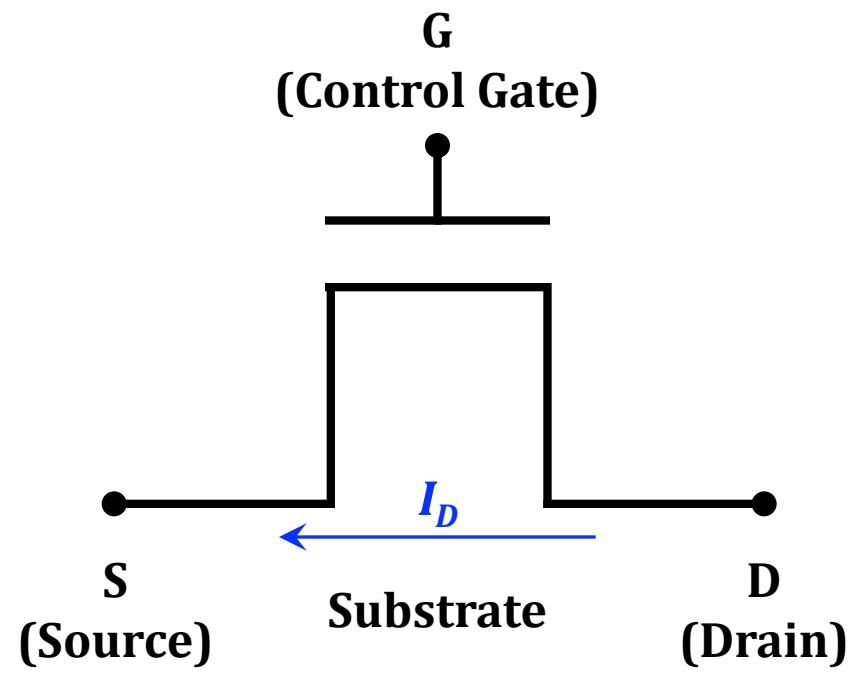

text_image

G
(Control Gate)
S
(Source)
Substrate
I_D
D
(Drain)

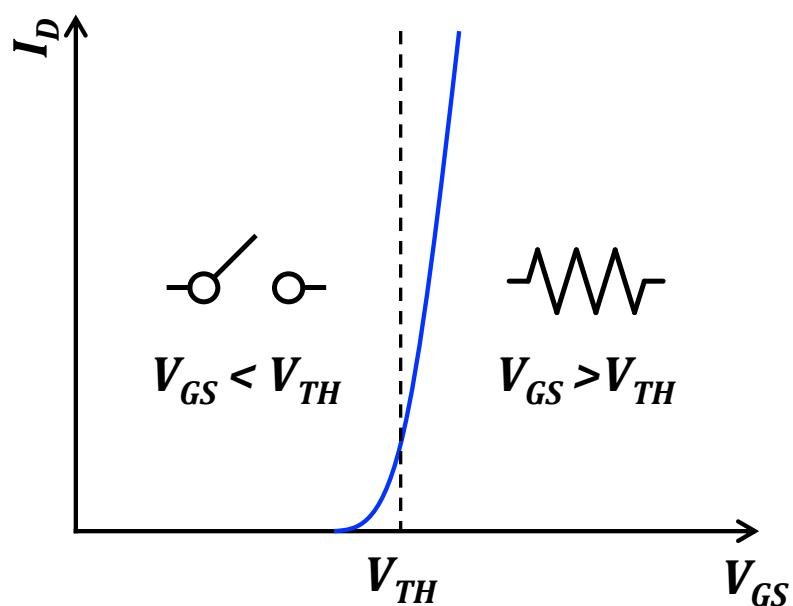

line

| V_GS Range       | I_D Value |
| ---------------- | --------- |
| V_GS < V_TH      | Low       |
| V_TH             | High      |
| V_GS > V_TH      | High      |

(Threshold Voltage)

# A Flash Cell

Basically, it is a transistor

 $\boldsymbol { \mathsf { W } } /$ a special material: Floating gate (2D) or Charge trap (3D)

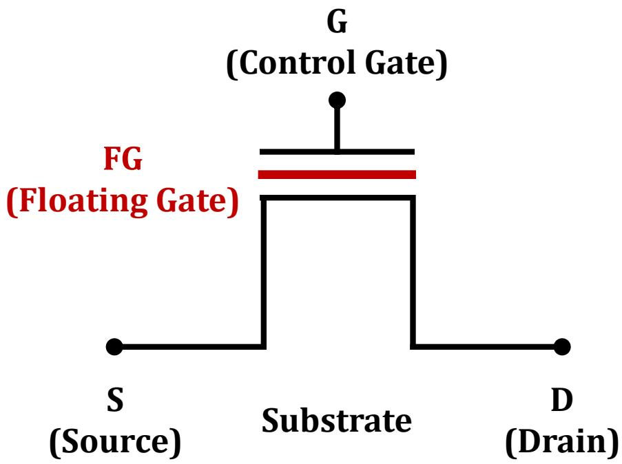

text_image

G
(Control Gate)
FG
(Floating Gate)
S
(Source)
Substrate
D
(Drain)

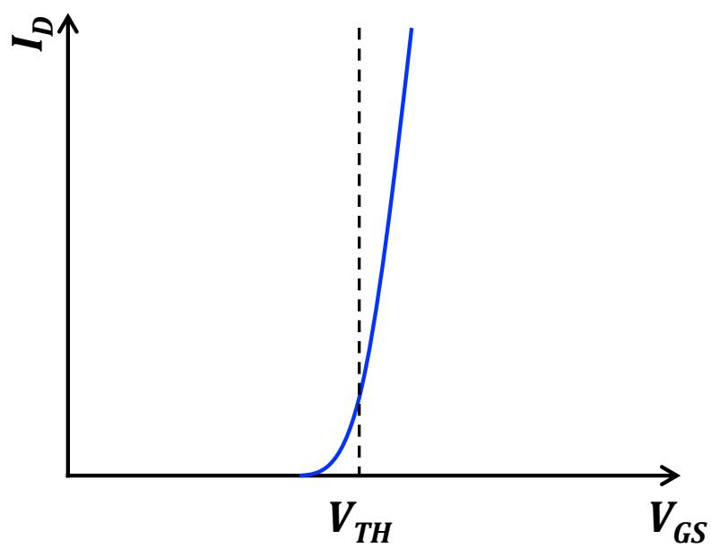

line

| V_GS | I_D |
|------|-----|
| V_TH | Peak |

Basically, it is a transistor

 w/ a special material: Floating gate (2D) or Charge trap (3D)   
Can hold electrons in a non-volatile manner

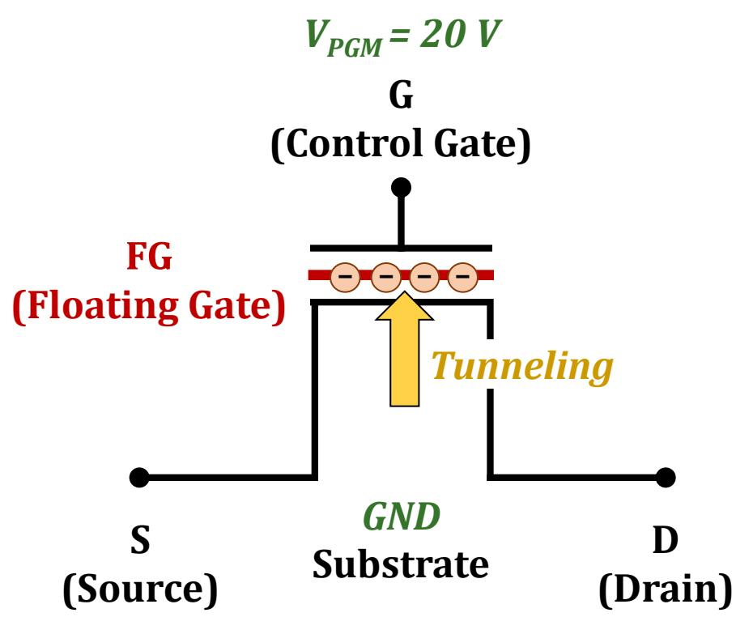

text_image

VPGM = 20 V
G
(Control Gate)
FG
(Floating Gate)
Tunneling
S
(Source)
GND
Substrate
D
(Drain)

line

| V_GS | I_D |
|------|-----|
| V_TH | Peak |

Basically, it is a transistor

 $\boldsymbol { \mathsf { W } } /$ a special material: Floating gate (2D) or Charge trap (3D)   
Can hold electrons in a non-volatile manner   
Changes the cell’s threshold voltage $( V _ { \mathsf { T H } } )$

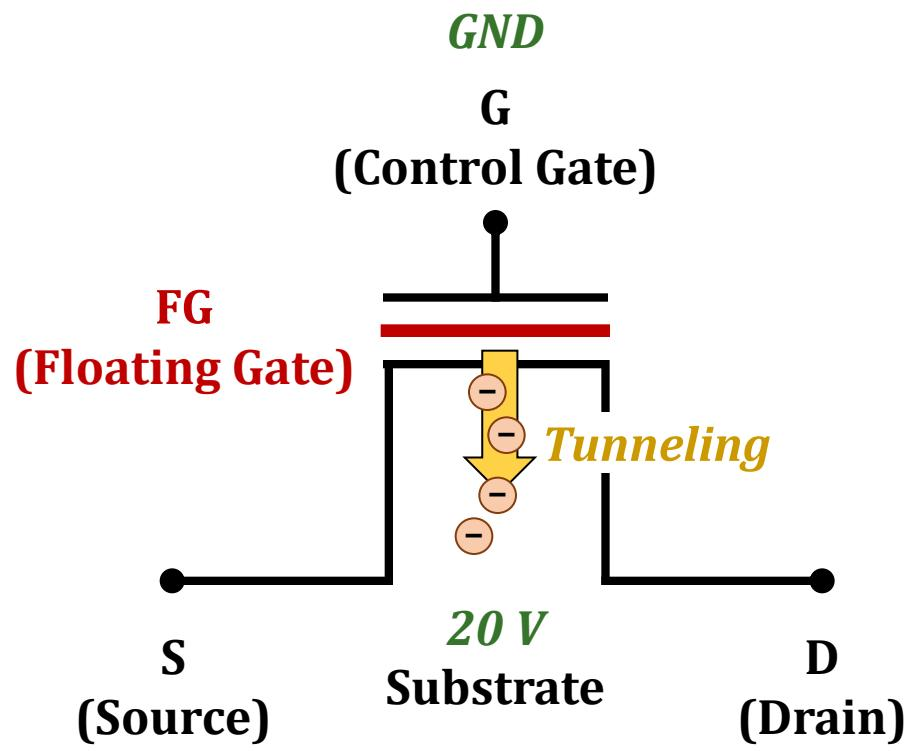

text_image

GND
G
(Control Gate)
FG
(Floating Gate)
Tunneling
20 V
Substrate
S (Source) D (Drain)

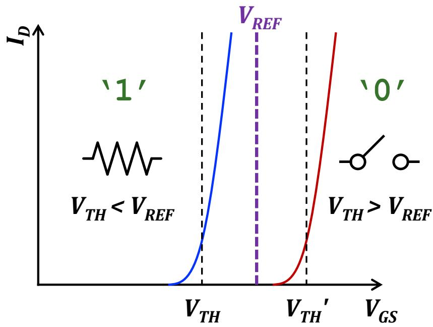

line

| V_TH | I_D (Blue Line) | I_D (Red Line) |
|------|-----------------|----------------|
| V_TH | ~0              | ~0             |
| V_TH' | High            | Low            |
| V_GS | High            | High           |

Multi-leveling: A flash cell can store multiple bits

Program: Inject electrons   
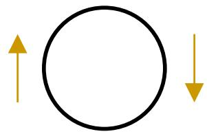

natural_image

Simple diagram with a circle and two arrows pointing upward and downward (no text or symbols)

Flash Cell   
Erase: Eject electrons

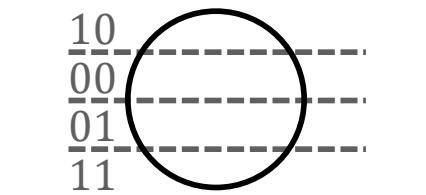

text_image

10
00
01
11

2-bit Multi-level Cell

Retention loss: A cell leaks electrons over time

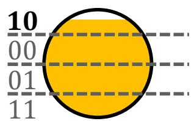

text_image

10
00
01
11

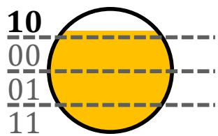

text_image

10
00
01
11

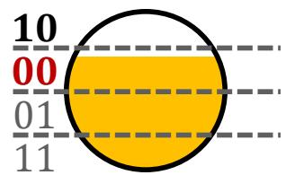

pie

| Category | Value |
|---|---|
| 00 | 10 |
| 01 | 01 |
| 10 | 11 |
The chart displays a single filled circle representing 10 units of a total. The other three columns are not explicitly labeled but are visually represented as smaller segments on the right side.

Retention error!

Limited lifetime: A cell wears out after P/E cycling

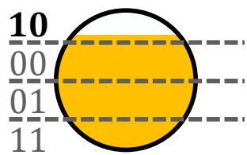

text_image

10
00
01
11

1 year @ 1K P/E cycles   

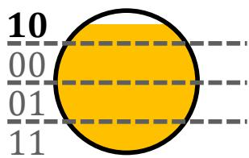

pie

| Category | Value |
|---|---|
| 10 | 10 |
| 00 | 00 |
| 01 | 01 |
| 11 | 11 |

  
1 year @ 10K P/E cycles

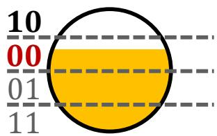

pie

| Segment | Value |
|---|---|
| 10 | 10 |
| 00 | 00 |
| 01 | 01 |
| 11 | 11 |

Retention error!

 Multiple (e.g., 128) flash cells are serially connected

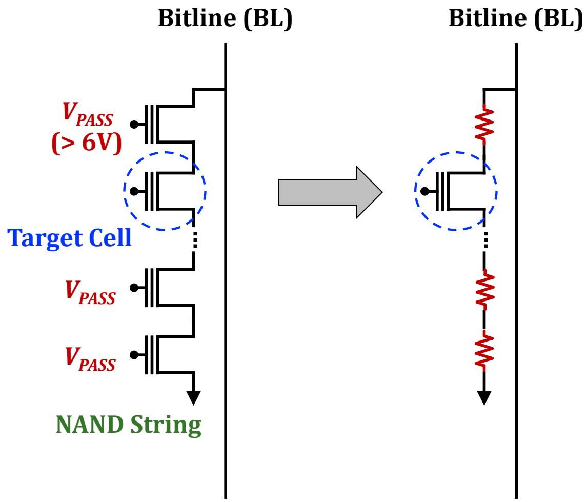

text_image

Bitline (BL)
V_PASS (> 6V)
Target Cell
V_PASS
V_PASS
NAND String
Bitline (BL)

# Pages and Blocks

 A large number $( > 1 0 0 , 0 0 0 )$ of cells operate concurrently

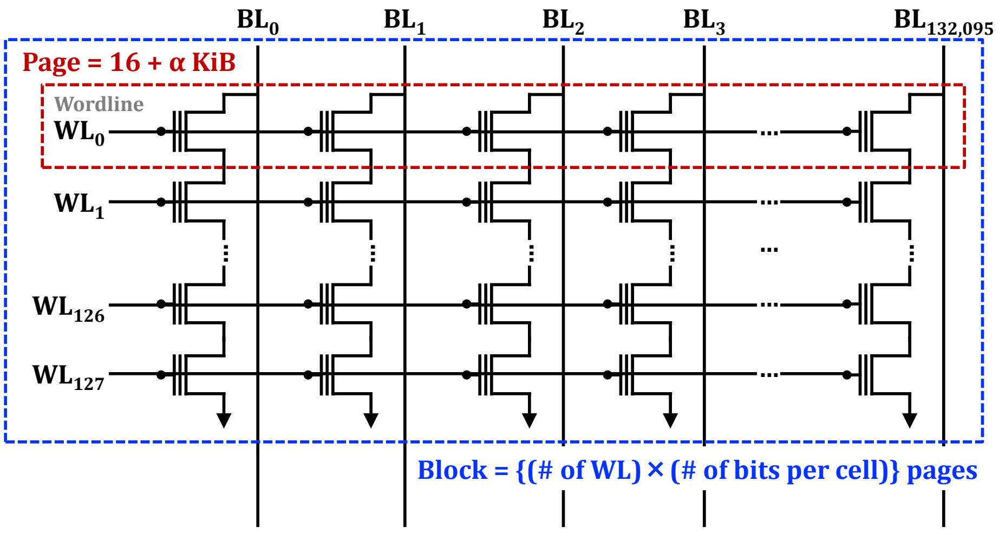

other

| Block | Wordline WL0 | Wordline WL1 | Wordline WL126 | Wordline WL127 |
|-------|--------------|--------------|----------------|----------------|
| Block | 16 + α KiB    | -            | -              | -              |
| Block = {(# of WL) × (# of bits per cell)} pages | -            | -            | -              | -              |

# Pages and Blocks (Continued)

Program and erase: Unidirectional

Programming a cell  Increasing the cell’s $\mathsf { V } _ { \mathsf { T H } }$   
Eraseing a cell  Decreasing the cell’s $\mathsf { V } _ { \mathsf { T H } }$

 Programming a page cannot change ‘0’ cells to ‘1’ cells  Erase-before-write property

Erase unit: Block

Increase erase bandwidth   
Makes in-place write on a page very inefficient  Out-of-place write & GC

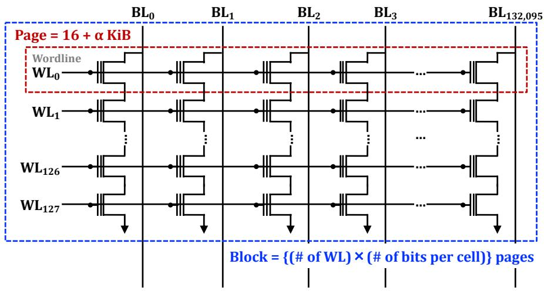

flowchart

```mermaid
graph TD
    subgraph_Block["Block = {(# of WL) × (# of bits per cell)} pages"]
        direction TB
        A["Wordline WL0"] --> B["Block"]
        C["Wordline WL1"] --> D["Block"]
        E["Wordline WL126"] --> F["Block"]
        G["Wordline WL127"] --> H["Block"]
    end
    subgraph_Page["Page = 16 + α KiB"]
        I["Block"]
        J["Wordline"]
        K["Wordline"]
        L["Wordline"]
        M["Wordline"]
        N["Wordline"]
    end
    style Block fill:#f9f,stroke:#333
    style Page fill:#ccf,stroke:#333
    note right of A: BL0
    note left of I: BL1
    note right of J: BL2
    note right of K: BL3
    note left of L: BL126
    note right of M: BL127
    note right of N: BL132,095
```

 A large number (> 1,000) of blocks share bitlines in a plane

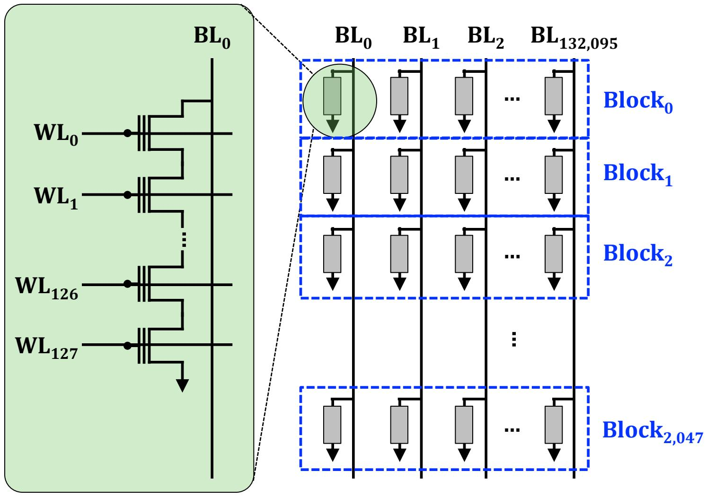

flowchart

```mermaid
graph TD
    subgraph BL0
        WL0["WL₀"] --> BL0
        WL1["WL₁"] --> BL0
        WL126["WL₁₂₆"] --> BL0
        WL127["WL₁₂₇"] --> BL0
    end
    
    subgraph BL1
        Block0["Block₀"] --> BL0
        Block1["Block₁"] --> BL0
        Block2["Block₂"] --> BL0
        Block2_047["Block₂,₀₄₇"] --> BL0
        Block0 --> BL1["BL₁"]
        Block1 --> BL1
        Block2 --> BL1
        Block2_047 --> BL1
        Block0 --> BL2["BL₂"]
        Block1 --> BL2
        Block2 --> BL2
        Block2_047 --> BL2
        Block0 --> BL3["BL₃"]
        Block1 --> BL3
        Block2 --> BL3
        Block2_047 --> BL3
    end
    
    subgraph BL132_095
        Block0_Block1_Block2_Block2_Block2_Block2_Block2_Block2_Block2_Block2_Block2_Block2_Block2_Block2_Block2_Block2_Block2_Block2_Block2_Block2_Block2_Block2_Block2_Block2_Block2_Block2_Block2_Block2_Block2_Block2_Block2_Block2_Block2_Block2_Block2_Block2
    end
    
    subgraph Block0
        Block0_Block1_Block2_Block2_Block2_Block2_Block2_Block2_Block2_Block2_Block2_Block2_Block2_Block2_Block2_Block2_Block2_Block2_Block2_Block2_Block2_Block2_Block2_Block2_Block2_Block2_Block2_Block2_Block2_Block2_Block2_Block2_Block3
    end
    
    subgraph Block1
        Block1_Block1_Block2_Block2_Block2_Block2_Block2_Block2_Block2_Block2_Block2_Block2_Block2_Block2_Block2_Block2_Block2_Block2_Block2_Block3
    end
    
    subgraph Block2
        Block1_Block1_Block2_Block3
        Block1_Block1_Block3
        Block1_Block1_Block4
        Block1_Block1_Block5
        Block1_Block1_Block6
        Block1_Block1_Block7
        Block1_Block1_Block8
        Block1_Block1_Block9
        Block1_Block1_Block10
        Block1_Block1_Block11
        Block1_Block1_Block12
        Block1_Block1_Block13
        Block1_Block1_Block14
        Block1_Block1_Block15
        Block1_Block1_Block16
        Block1_Block1_Block17
        Block1_Block1_Block18
        Block1_Block1_Block19
        Block1_Block1  Block13
    end
```

 A large number (> 1,000) of blocks share bitlines in a plane

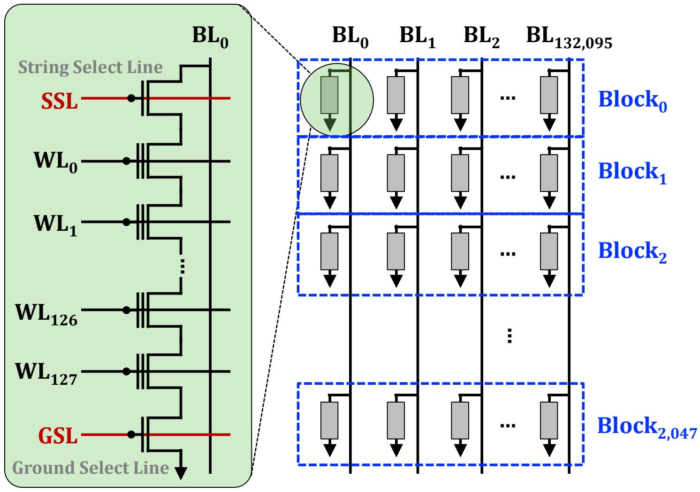

flowchart

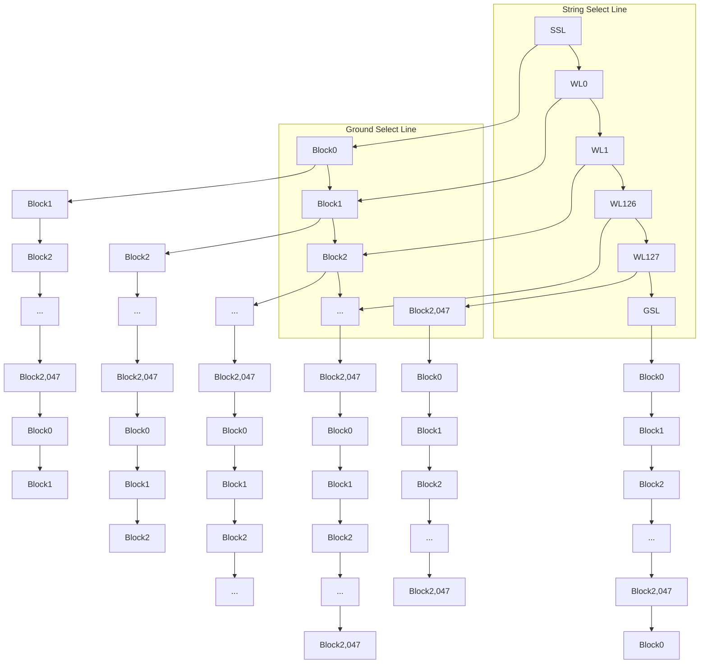
```mermaid
graph TD
    subgraph "String Select Line"
        A["SSL"] --> B["WL0"]
        B --> C["WL1"]
        C --> D["WL126"]
        D --> E["WL127"]
        E --> F["GSL"]
    end

    subgraph "Ground Select Line"
        G["Block0"] --> H["Block1"]
        H --> I["Block2"]
        I --> J["..."]
        K["Block2,047"]
    end

    A --> G
    B --> H
    C --> I
    D --> J
    E --> K
    F --> L["Block0"]
    G --> M["Block1"]
    H --> N["Block2"]
    I --> O["..."]
    J --> P["Block2,047"]
    K --> Q["Block0"]
    L --> R["Block1"]
    M --> S["Block2"]
    N --> T["..."]
    O --> U["Block2,047"]
    P --> V["Block0"]
    Q --> W["Block1"]
    R --> X["Block2"]
    S --> Y["..."]
    T --> Z["Block2,047"]
    U --> AA["Block0"]
    V --> AB["Block1"]
    W --> AC["Block2"]
    X --> AD["..."]
    Y --> AE["Block2,047"]
    Z --> AF["Block0"]
    AA --> AG["Block1"]
    AB --> AH["Block2"]
    AC --> AI["..."]
    AD --> AJ["Block2,047"]
    AE --> AK["Block0"]
    AF --> AL["Block1"]
    AG --> AM["Block2"]
    AH --> AN["..."]
    AI --> AO["Block2,047"]
    AJ --> AP["Block0"]
    AK --> AQ["Block1"]
    AL --> AR["Block2"]
    AM --> AS["..."]
    AN --> AT["Block2,047"]
```

# Planes and Dies

 A die contains multiple (e.g., 2 – 4) planes

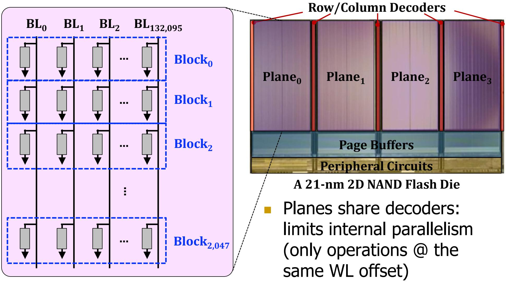

flowchart

```mermaid
graph TD
    subgraph Block0
        A["Block₀"] --> B["Block₁"]
        C["Block₁"] --> D["..."]
        E["Block₂"] --> F["..."]
        G["..."]
    end
    subgraph Block2
        H["Block₂"] --> I["..."]
        J["..."]
    end
    subgraph Block2,047
        K["Block₂,047"] --> L["..."]
    end

    subgraph Row/Column Decoders
        M["Plane₀"] --> N["Plane₁"] --> O["Plane₂"] --> P["Plane₃"]
        Q["Page Buffers"] --> R["Peripheral Circuits"]
    end

    style Block0 fill:#f9f,stroke:#333
    style Block2 fill:#f9f,stroke:#333
    style Block2,047 fill:#f9f,stroke:#333

    note right of M: Planes share decoders: limits internal parallelism (only operations @ the same WL offset)

    note right of A: A 21-nm 2D NAND Flash Die
    note right of A: Planes share decoders: limits internal parallelism (only operations @ the same WL offset)
```

# P&S Modern SSDs

# Basics of NAND Flash-Based SSDs

Dr. Mohammad Sadrosadati

Prof. Onur Mutlu

ETH Zürich

Fall 2022

12 October 2022