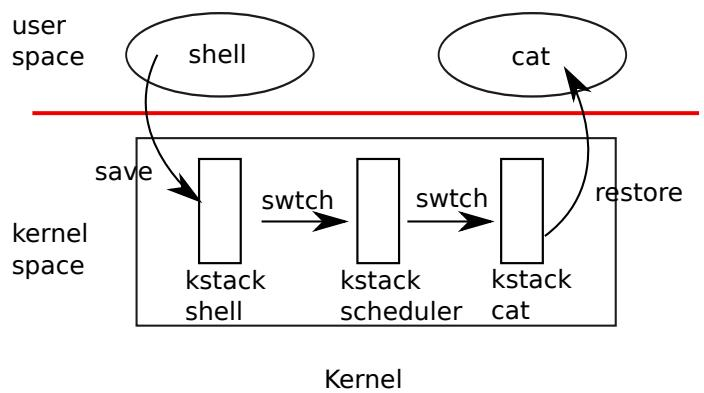
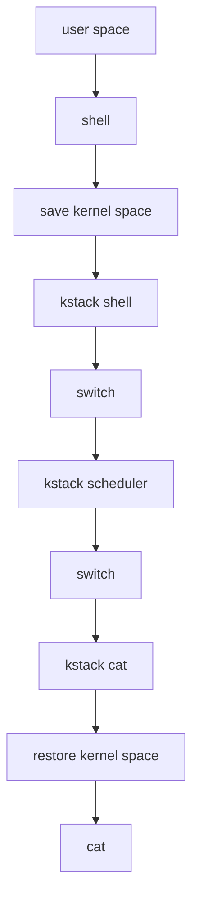
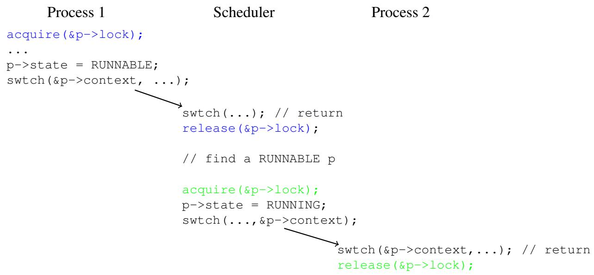

# Chapter 8

# Scheduling

Any operating system is likely to run with more processes than the computer has CPUs, so a plan is needed to time-share the CPUs among the processes. Ideally the sharing would be transparent to user processes. A common approach is to provide each process with the illusion that it has its own virtual CPU by multiplexing the processes onto the hardware CPUs. This chapter explains how xv6 achieves this multiplexing.

Before proceeding with this chapter, please read kernel/proc.h, kernel/swtch.S, and yield(), sched(), and schedule() in kernel/proc.c.

# 8.1 Multiplexing

Xv6 multiplexes by switching each CPU from one process to another in two situations. First, xv6 switches when a process makes a system call that blocks (has to wait), for example read or wait. Second, xv6 periodically forces a switch to cope with processes that compute for long periods without blocking. The former are called voluntary switches, the latter involuntary.

Implementing multiplexing poses a few challenges. First, how to switch from one process to another? The basic idea is to save and restore CPU registers, though the fact that this cannot be expressed in C makes it tricky. Second, how to force switches in a way that is transparent to user processes? Xv6 uses the standard technique in which a hardware timer’s interrupts drive context switches. Third, all of the CPUs switch among the same set of processes, so a locking plan is necessary to avoid mistakes such as two CPUs deciding to run the same process at the same time. Fourth, a process’s memory and other resources must be freed when the process exits, but it cannot finish all of this itself. Fifth, each CPU of a multi-core machine must remember which process it is executing so that system calls affect the correct process’s kernel state.

# 8.2 Context switch overview

The term “context switch” refers to the steps involved in a CPU leaving off execution of one kernel thread (usually for later resumption), and resuming execution of a different kernel thread; this switching is the heart of multiplexing. Xv6 does not directly context switch from one process’s kernel thread to another process’s kernel thread; instead, a kernel thread gives up the CPU by context-switching to that CPU’s “scheduler thread,” and the scheduler thread picks a different process’s kernel thread to run, and context-switches to that thread.



<details>
<summary>flowchart</summary>


</details>

Figure 8.1: Switching from one user process to another. In this example, xv6 runs with one CPU (and thus one scheduler thread).

At a broader scope, the steps involved in switching from one user process to another are illustrated in Figure 8.1: a trap (system call or interrupt) from the old process’s user space to its kernel thread, a context switch to the current CPU’s scheduler thread, a context switch to a new process’s kernel thread, and a trap return to the user-level process.

# 8.3 Code: Context switching

The function swtch() in kernel/swtch.S contains the heart of thread context switching: it saves the switched-from thread’s CPU registers, and restores the previously-saved registers of the switched-to thread. The basic reason this is sufficient is that a thread’s state consist of data in memory (e.g. its stack) plus its CPU registers; thread memory need not saved and restored because different threads keep their data in different areas of RAM; but the CPU has only one set of registers so they must be switched (saved and restored) between threads.

Each thread’s struct proc includes a struct context that holds the thread’s saved registers when it is not running. A CPU’s scheduler thread’s struct context is in that CPU’s struct cpu. When thread X wishes to switch to thread Y, thread X calls swtch(&X’s context, &Y’s context). swtch() saves the current CPU registers in X’s context, then loads the content of Y’s context into the CPU registers, then returns.

Here’s an abbreviated copy of swtch:

swtch:

```txt
sd ra, 0 (a0)
sd sp, 8 (a0)
sd s0, 16 (a0)
... 
```

```asm
sd s11, 104(a0)
ld ra, 0(a1)
ld sp, 8(a1)
ld s0, 16(a1)
...
ld s11, 104(a1)
ret 
```

a0 holds the first function argument, and a1 the second; in this case, the two struct context pointers. 16(a0) refers to an offset 16 bytes into the memory pointed to by a0; referring to the definition of struct context in kernel/proc.h (1951), this is the structure field called s0.

Where does swtch’s ret return to? It returns to the instruction that the ra register points to. In the example in which thread X calls swtch() to switch to Y, when ret executes, ra has just been loaded from Y’s struct context. And the ra in Y’s struct context was originally saved by Y’s call to swtch when Y gave up the CPU in the past. So the ret returns to the instruction after the point at which Y called swtch(); that is, X’s call to swtch() returns as if returning from Y’s original call to swtch(). And sp will be Y’s stack pointer, since swtch loaded sp from Y’s struct context; thus on return, Y will execute on its own stack. swtch() need not directly save or restore the program counter; it’s enough to save and restore ra.

swtch (2902) saves callee-saved registers (ra,sp,s0..s11) but not caller-saved registers. The RISC-V calling convention requires that if code needs to preserve the value in a caller-saved register across a function call, the compiler must generate instructions that save the register to the stack before the function call, and restore from the stack when the function returns. So swtch can rely on the function that called it having already saved the caller-saved registers (either that, or the calling function didn’t need the values in the registers).

# 8.4 Code: Scheduling

The last section looked at the internals of swtch; now let’s take swtch as a given and examine switching from one process’s kernel thread through the scheduler to another process. The scheduler exists in the form of a special thread per CPU, each running the scheduler function. This function is in charge of choosing which process to run next. Each CPU has its own scheduler thread because more than one CPU may be looking for something to run at any given time. Process switching always goes through the scheduler thread, rather than direct from one process to another, to avoid some situations in which there would be no stack on which to execute the scheduler (e.g. if the old process has exited, or there is no other process that currently wants to run).

A process that wants to give up the CPU must acquire its own process lock p->lock, release any other locks it is holding, update its own state (p->state), and then call sched. You can see this sequence in yield (2629), sleep and kexit. sched calls swtch to save the current context in p->context and switch to the scheduler context in cpu->context. swtch returns on the scheduler’s stack as though scheduler’s swtch had returned (2582).



<details>
<summary>text_image</summary>

Process 1
acquire(&p->lock);
...
p->state = RUNNABLE;
swtch(&p->context, ...);

    swtch(...); // return
    release(&p->lock);

        // find a RUNNABLE p

    acquire(&p->lock);
    p->state = RUNNING;
    swtch(...,&p->context);

            swtch(&p->context,...); // return
    release(&p->lock);
</details>

Figure 8.2: swtch() always has the scheduler thread as either source or destination, and the relevant p->lock is always held.

scheduler (2558) runs a loop: find a process to run, swtch() to it, eventually it will swtch() back to the scheduler, which continues its loop. The scheduler loops over the process table looking for a runnable process, one that has $\mathrm { p { - } { > } s t a t e ~ } = \mathrm { - } \mathrm { \sf ~ R U N N A B L E }$ . Once it finds a process, it sets the per-CPU current process variable c->proc, marks the process as RUNNING, and then calls swtch to start running it (2577-2582). At some point in the past, the target process must have called swtch(); the scheduler’s call to swtch() effectively returns from that earlier call. Figure 8.2 illustrates this pattern.

xv6 holds p->lock across calls to swtch: the caller of swtch acquires the lock, but it’s released in the target after swtch returns. This arrangement is unusual: it’s more common for the thread that acquires a lock to also release it. Xv6’s context switching breaks this convention because p->state and p->context must be updated together atomically. For example, if p->lock were released before invoking swtch, a different CPU c might decide to run the process because its state is RUNNABLE. CPU c will invoke swtch which will restore from p->context while the original CPU is still saving into p->context. The result would be that the process would be restored with partially-saved registers on CPU c and that both CPUs will be using the same stack, which would cause chaos. Once yield has started to modify a running process’s state to make it RUNNABLE, p->lock must remain held until the process has saved all its registers and the scheduler is running on its stack. The earliest correct release point is after scheduler (running on its own stack) clears c->proc. Similarly, once scheduler starts to convert a RUNNABLE process to

RUNNING, the lock cannot be released until the process’s kernel thread is completely running (after the swtch, for example in yield).

There is one case when the scheduler’s call to swtch does not end up in sched. allocproc sets the context ra register of a new process to forkret (2653), so that its first swtch “returns” to the start of that function. forkret exists to release the p->lock and set up some control registers and trapframe fields that are required in order to return to user space. At the end, forkret simulates the normal return path from a system call back to user space.

# 8.5 Code: mycpu and myproc

Xv6 often needs a pointer to the current process’s proc structure. On a uniprocessor one could have a global variable pointing to the current proc. This doesn’t work on a multi-core machine, since each CPU executes a different process. The way to solve this problem is to exploit the fact that each CPU has its own set of registers.

While a given CPU is executing in the kernel, xv6 ensures that the CPU’s tp register always holds the CPU’s hartid. RISC-V numbers its CPUs, giving each a unique hartid. mycpu (2178) uses tp to index an array of cpu structures and return the one for the current CPU. A struct cpu (1971) holds a pointer to the proc structure of the process currently running on that CPU (if any), saved registers for the CPU’s scheduler thread, and the count of nested spinlocks needed to manage interrupt disabling.

Ensuring that a CPU’s tp holds the CPU’s hartid is a little involved, since user code is free to modify tp. start sets the tp register early in the CPU’s boot sequence, while still in machine mode (1094). While preparing to return to user space, prepare\_return saves tp in the trampoline page, in case user code modifies it. Finally, uservec restores that saved tp when entering the kernel from user space (3127). The compiler guarantees never to modify tp in kernel code. It would be more convenient if xv6 could ask the RISC-V hardware for the current hartid whenever needed, but RISC-V allows that only in machine mode, not in supervisor mode.

The return values of cpuid and mycpu are fragile: if the timer were to interrupt and cause the thread to yield and later resume execution on a different CPU, a previously returned value would no longer be correct. To avoid this problem, xv6 requires code to disable interrupts before calling cpuid() or mycpu(), and only enable interrupts when done using the returned value.

The function myproc (2187) returns the struct proc pointer for the process that is running on the current CPU. myproc disables interrupts, invokes mycpu, fetches the current process pointer (c->proc) out of the struct cpu, and then enables interrupts. The return value of myproc is safe to use even if interrupts are enabled: if a timer interrupt moves the calling process to a different CPU, its struct proc pointer will stay the same.

# 8.6 Real world

The xv6 scheduler implements a simple scheduling policy that runs each process in turn. This policy is called round robin. Real operating systems implement more sophisticated policies that, for example, allow processes to have priorities. The idea is that a runnable high-priority process will be preferred by the scheduler over a runnable low-priority process. These policies can become complex because there are often competing goals: for example, the operating system might also want to guarantee fairness and high throughput.

# 8.7 Exercises

1. Modify xv6 to use only one context switch when switching from one process’s kernel thread to another, rather than switching through the scheduler thread. The yielding thread will need to select the next thread itself and call swtch. The challenges will be to prevent multiple CPUs from executing the same thread accidentally; to get the locking right; and to avoid deadlocks.