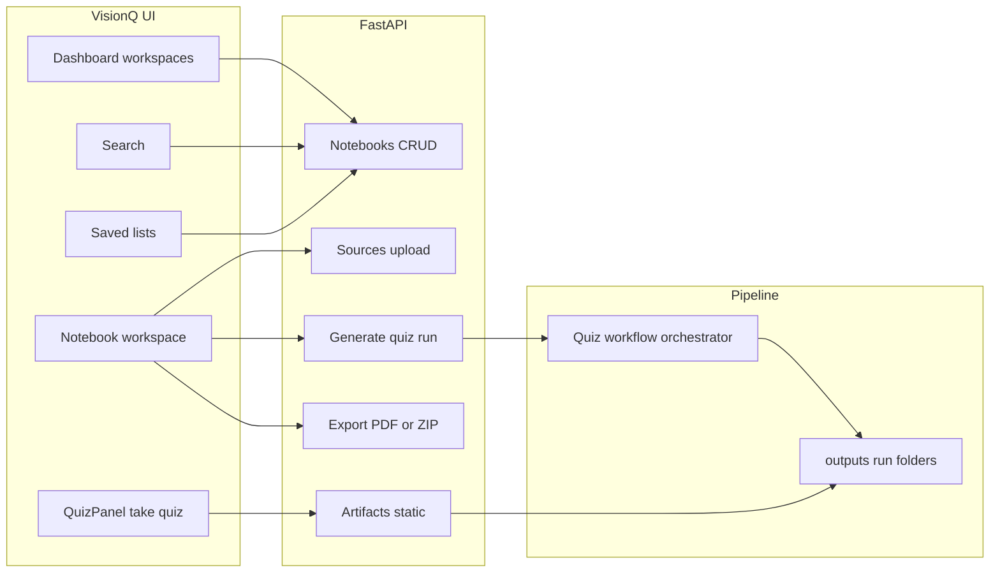

# Key features of the app (VisionQ / Multimodal Quiz)

This document describes the **VisionQ** web application and how it relates to the broader framework. It complements the research-oriented [README.md](../README.md) and run instructions in [README.run.md](../README.run.md).

---

## What the product is

**VisionQ** is a web application for turning documents into **multimodal quizzes**: questions that can include **AI-generated or document-grounded images**, not only plain text. The backend wires the UI to the same **agent-style pipeline** the research README describes: document understanding, knowledge construction, quiz planning, multimodal generation, and verification—producing structured runs under `outputs/` with `questions.json`, images, and logs.

---

## Authentication and deployment modes

- **Optional Supabase auth**: When Supabase environment variables are set, routes are wrapped in [`RequireAuth`](../frontend/src/components/auth/RequireAuth.jsx) and users sign in via login/signup; the API client sends a **Bearer token** ([`api.js`](../frontend/src/api.js)).
- **Local mode**: If Supabase is not configured, the UI is still usable without login; persistence falls back to **local filesystem** paths (see README.run: `.localdata/`, `data/uploads/`).
- **Health endpoint** (`/api/health`) reports whether Supabase and auth are enabled.

---

## Workspaces (notebooks)

- **Create and list workspaces** from the dashboard ([`DashboardPage`](../frontend/src/pages/DashboardPage.jsx)); each workspace is a container for sources and generation **runs**.
- **Rename workspace** inline on the notebook page (`PATCH /api/notebooks/{id}`).
- **Filters and views**: chips for *all / my / highlights (has generated questions) / shared*, plus **grid vs list** layout; relative “edited ago” timestamps on cards.
- **Keyboard shortcut**: **Ctrl/Cmd+K** jumps to global search.

---

## Global search

- **[`SearchPage`](../frontend/src/pages/SearchPage.jsx)** debounces input and calls `GET /api/notebooks?q=…` to find workspaces by **title or description**.

---

## Sources and document-driven generation

- **Upload sources** per workspace ([`SourcePanel`](../frontend/src/components/notebook/SourcePanel.jsx)): PDF, text/Markdown, plain text, HTML, and images; shows size and type.
- **Select a source** as the input document for the next quiz run.
- **Resizable two-pane workspace** ([`NotebookPage`](../frontend/src/pages/NotebookPage.jsx)): sources on the left, quiz experience on the right.

---

## Quiz configuration and generation

- **Quiz builder modal** ([`QuizBuilderModal`](../frontend/src/components/notebook/QuizBuilderModal.jsx)):
  - Choose **document** (source).
  - **Question count** between 1 and 20.
  - **Question type mix**: multiple choice, true/false, fill-in-the-blank, matching—converted to an **equal weight distribution** sent as `question_format_distribution` ([`quizFormatPresets.js`](../frontend/src/utils/quizFormatPresets.js)).
- **`POST /api/notebooks/{id}/generate`** kicks off the pipeline ([`main.py`](../api/main.py)); failures can surface as system messages in the data model (see [`services.py`](../api/services.py) exception handling). The API also supports **mock** image/question flags for testing (not wired in the default UI flow).

---

## Interactive quiz experience (multimodal)

- **[`QuizPanel`](../frontend/src/components/notebook/QuizPanel.jsx)** for **completed runs**:
  - Renders **per-question images** by resolving paths to `/api/artifacts/...` or absolute URLs.
  - Supports the canonical types scored in [`quizScoring.js`](../frontend/src/utils/quizScoring.js) (including **matching** pairs).
  - **Navigation** between questions, **results summary** (score ring, correct/wrong/unanswered), **redo** to clear attempts.
  - **Session persistence** in the browser ([`quizSessionStorage.js`](../frontend/src/utils/quizSessionStorage.js)) so refresh does not lose in-progress answers.
- **Run selection and deep links**: pick among runs for the workspace; URL query `?run=` selects a specific completed run.
- **Run lifecycle in UI**: **rename** and **delete** runs; after generation, the new run is selected automatically.

---

## Export

- **Export modal** ([`ExportOptionsModal`](../frontend/src/components/notebook/ExportOptionsModal.jsx)) backed by `GET /api/notebooks/{id}/runs/{run_id}/export`:
  - **PDF**: printable document with images, options, answers, explanations.
  - **ZIP**: question data **plus images**, with embedded data as **JSON or CSV**.

---

## Saved quiz lists (collections)

- **Saved** area ([`SavedPage`](../frontend/src/pages/SavedPage.jsx)): create **lists** with a **folder color**, open a list at `/saved/:listId`, add/remove items (each item ties a **notebook + run**).
- From the notebook, **Save to list** modal adds the current run to a chosen list ([`SaveToListModal`](../frontend/src/components/notebook/SaveToListModal.jsx)).

---

## Backend and static hosting

- **FastAPI** app title “Multimodal Quiz UI API”; **CORS** configured for the UI origin.
- **Artifact serving**: `GET /api/artifacts/{path}` returns files under the project root (guarded so paths cannot escape the repo).
- If `frontend/dist` exists, the API **mounts the built SPA** at `/` for single-origin deployment ([`main.py`](../api/main.py)).

---

## Research / CLI layer (same codebase, complementary to the web UI)

Documented in [README.md](../README.md): **CLI pipeline** (`scripts/run_pipeline.py`), **output folder layout** under `outputs/<run_id>/`, **interactive HTML** from `scripts/visualize_questions.py`, difficulty ratios, `topic_agentic` vs `legacy` generation mode, and **user-study** flows. These are the “full framework” features around the same core idea as the web app.

---

## API capability not currently surfaced in the UI

**Notebook messages** (`POST /api/notebooks/{id}/messages`) exist in [`api.js`](../frontend/src/api.js) and [`main.py`](../api/main.py), but there is **no matching chat panel** in the current [`NotebookPage`](../frontend/src/pages/NotebookPage.jsx) layout—omit from end-user marketing copy unless that UI is added.

---

## Architecture (high level)

